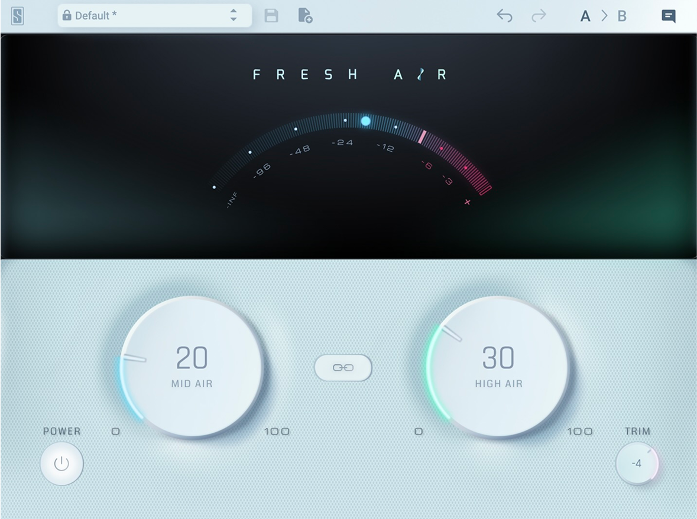

# G3X Fresh Air

G3X Fresh Air é o nome de trabalho de um processador de presença e ar com dois
macrocontroles. A primeira entrega será um VST3 64-bit
para Windows, desenvolvido em C++20 com JUCE e CMake, seguindo o processo dos
plugins G3X.

## Estado

**M3 — interface própria implementada; próxima etapa: Windows Alpha.**

- [PRD](PRD.md)
- [Referência visual e fontes](docs/references/README.md)
- [Captura da interface de referência](docs/references/slate-digital-fresh-air-interface.png)



## Limites da referência

O Slate Digital Fresh Air foi estudado somente para entender a categoria de
processadores de presença e ar, a separação entre duas regiões espectrais e o
fluxo de uma interface compacta. O plugin G3X terá DSP, marca, código,
interface, textos, componentes gráficos e presets próprios.

Nenhum ativo da Slate Digital será incorporado ao produto final.

## Implementação atual

- Engine DSP C++20 independente do framework.
- Curva `Presence` própria: banda larga móvel entre 3.2 e 5 kHz, até +6 dB.
- Curva `Air` própria: shelf móvel entre 8.5 e 11 kHz, até +10 dB.
- Suavização de 20 ms, suporte mono/estéreo e proteção numérica.
- Detectores Presence/Air com attack/release independentes e resposta vinculada
  entre canais para preservar a imagem estéreo.
- `Link bands` compartilha a maior redução dinâmica entre as duas regiões sem
  alterar a proporção estática definida pelos macrocontroles.
- Output trim de -12 a +3 dB e bypass por crossfade, ambos sem saltos abruptos.
- Interface G3X redimensionável com dois macrocontroles, presets e medidor de
  saída Peak/RMS com retenção de clipping.
- Controles nomeados para tecnologias assistivas, edição numérica e reset por
  duplo clique.
- Wrapper JUCE com parâmetros automatizáveis e estado serializado.
- Testes de resposta, neutralidade, estabilidade e paridade entre canais.

## Build

O projeto fixa JUCE `9.0.1` via CMake FetchContent.

```bash
cmake -S . -B build
cmake --build build --config Release
ctest --test-dir build --build-config Release --output-on-failure
```

## Download e instalação — Windows x64

1. Abra [Actions](https://github.com/6uilhermeTeixeira/plugin-g3x-fresh-air/actions) e selecione uma execução bem-sucedida da branch `main`.
2. Em **Artifacts**, baixe `G3X-Fresh-Air-Windows-x64-<commit>`. O download fica disponível por 30 dias; **Run workflow** permite gerar um novo build.
3. Extraia o ZIP. A raiz contém somente `SHA256SUMS.txt` e a pasta `G3X Fresh Air.vst3`, com todos os arquivos internos do plugin.
4. Na pasta extraída, abra o PowerShell e verifique o binário:

```powershell
$expected, $relativePath = (Get-Content -LiteralPath .\SHA256SUMS.txt -Raw).Trim() -split '  ', 2
$actual = (Get-FileHash -LiteralPath $relativePath -Algorithm SHA256).Hash.ToLowerInvariant()
if ($actual -ne $expected) { throw "SHA-256 divergente; baixe o artifact novamente." }
"SHA-256 confirmado."
```

5. Copie a pasta **`G3X Fresh Air.vst3` inteira** para `C:\Program Files\Common Files\VST3` e atualize a busca de plugins da DAW. A cópia pode solicitar permissão de administrador.

O SHA-256 verifica o binário Windows x64 dentro do bundle; não é o hash do ZIP ou dos recursos. O artifact contém o VST3 Release; o aplicativo Standalone continua disponível como alvo de compilação, mas não é incluído no download.
